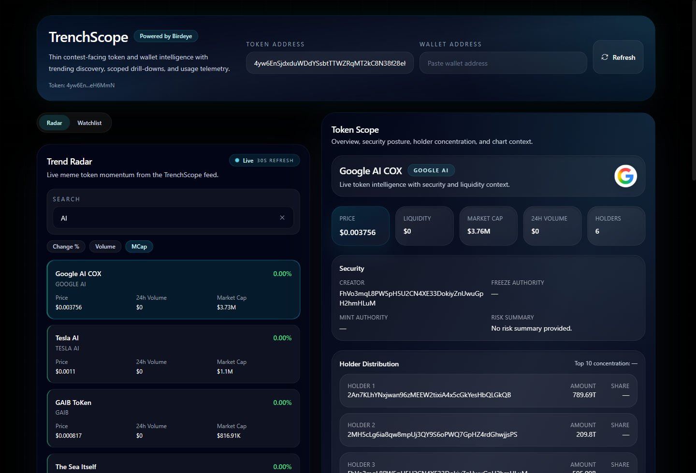
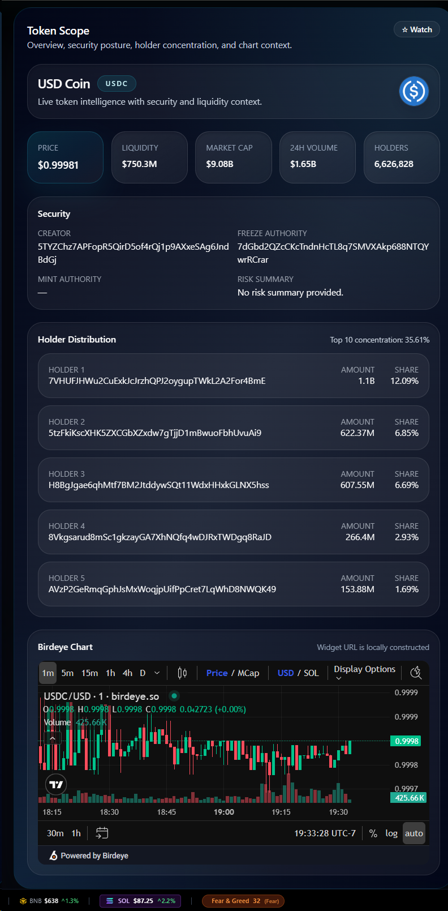
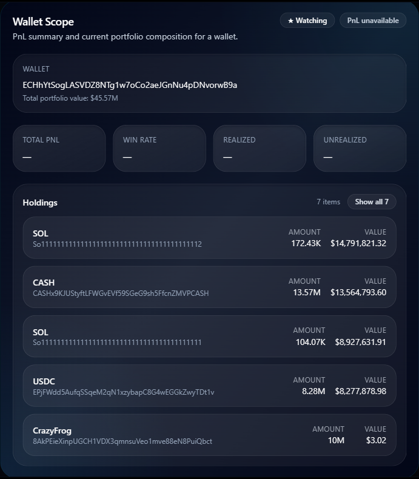
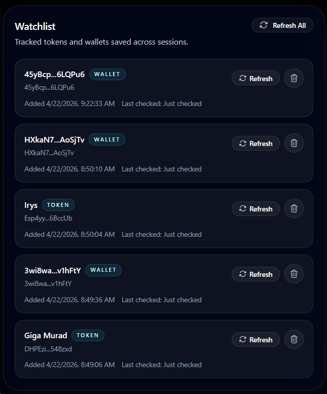

# TrenchScope 🔭

**Solana trader intelligence powered by [Birdeye](https://birdeye.so) Data.**



## Why TrenchScope Exists

Solana traders lose time switching between trend feeds, token pages, and wallet tools just to answer basic questions: what is moving, who is involved, and whether the setup is worth deeper attention.

TrenchScope brings **token discovery**, **token context**, **wallet inspection**, and **usage transparency** into one Birdeye-powered surface so triage happens faster with less tab-hopping.

## What TrenchScope Does

| Surface | What it does |
| --- | --- |
| **Token Radar+** | Surfaces trending Birdeye meme tokens with client-side search, local sort by Change % / Volume / Market Cap, and fast jump into Token Scope. |
| **Token Scope** | Shows price context, liquidity, market cap, holder distribution, best-effort security status, and an embedded Birdeye chart for any token. |
| **Wallet Scope** | Shows Birdeye PnL summary, total portfolio value, win rate, and sorted holdings for any Solana wallet. |
| **Watchlist** | Keeps tracked tokens and wallets visible across sessions using localStorage, with per-item and batch refresh using sequential API pacing. |
| **Usage Dashboard** | Exposes Birdeye-backed request telemetry so progress toward the competition’s 50+ API-call qualification floor stays visible. |

## Product Tour

The hero shot above shows the full working flow:
**Trend Radar → Token Scope → Wallet Scope → Usage**.

<table>
  <tr>
    <td align="center" valign="top">
      <a href="docs/screenshots/trenchscope-token-scope.png">
        
      </a>
      <br /><strong>Token Scope</strong><br />
      <sub>Token intel, holder concentration, and Birdeye chart.</sub>
    </td>
    <td align="center" valign="top">
      <a href="docs/screenshots/trenchscope-wallet-scope.png">
        
      </a>
      <br /><strong>Wallet Scope</strong><br />
      <sub>PnL, win rate, portfolio value, and top holdings.</sub>
    </td>
    <td align="center" valign="top">
      <a href="docs/screenshots/trenchscope-watchlist.png">
        
      </a>
      <br /><strong>Watchlist</strong><br />
      <sub>Tracked tokens and wallets with refresh controls.</sub>
    </td>
  </tr>
</table>

## Birdeye Endpoints Used

| Endpoint | Purpose |
| --- | --- |
| `/defi/v3/token/meme/list` | Token Radar+ feed for trending token discovery |
| `/defi/token_overview` | Token overview: price, liquidity, market cap, volume, holders |
| `/defi/v3/token/holder` | Holder distribution and top-holder context |
| `/defi/token_security` | Best-effort token security context (graceful fallback when unavailable) |
| `/wallet/v2/pnl/summary` | Wallet PnL summary for trader performance inspection |
| `/wallet/v2/current-net-worth` | Wallet holdings and current net-worth context |

## API Usage Proof

TrenchScope does not fake request activity. Every Birdeye call is counted server-side and surfaced in the in-app **Usage Dashboard**.

Normal product flows already generate meaningful multi-endpoint traffic:
- Trend Radar refreshes the meme discovery feed
- Token drill-downs fan out into overview, holder concentration, and security lookups
- Wallet inspection combines PnL and current net-worth data
- Watchlist refreshes reuse the same live product routes with paced sequential calls

This means the project clears Birdeye's **50+ API-call qualification floor** through real usage, not synthetic load scripts.

## Architecture

TrenchScope uses a **React frontend** and an **Express proxy** so Birdeye requests stay server-side. The frontend talks to local `/api/trenchscope/*` routes, the proxy handles request shaping and telemetry, and the upstream data source is the Birdeye API.

```
Browser  →  React (Vite)  →  Express Proxy  →  Birdeye API
                                  ↓
                          Usage Tracking (file-based)
```

**Why this architecture holds up under real API conditions**
- **Server-side proxy:** Birdeye keys stay out of the browser and request behavior stays controllable
- **Retry-aware backoff:** `429` responses are retried with `Retry-After` support instead of blindly spamming upstream
- **Sequential watchlist refresh:** batch refresh is intentionally paced to avoid rate-limit storms
- **Graceful degradation:** partial upstream failures degrade into warnings or unavailable states instead of collapsing the whole screen
- **Persistent usage tracking:** request counters survive restarts without adding database overhead
- **Thin response shaping:** The proxy normalizes Birdeye response differences so the frontend gets a stable, predictable data shape

## Tech Stack

React · Vite · Express · Tailwind CSS · Birdeye API · localStorage

## Testing

```bash
npm test
```

The current test suite covers adapter response mapping, retry/backoff behavior, usage-store persistence, API server wiring, and the client-side radar/watchlist utility logic that powers the judged flow.

## Quick Start

**Prerequisites:** Node.js 18+ and a [Birdeye API key](https://birdeye.so).

```bash
# 1. Install dependencies
npm install

# 2. Set your Birdeye API key
#    Create a .env file in the project root:
echo "BIRDEYE_API_KEY=your_key_here" > .env

# 3. Start the full app
npm run dev
```

TrenchScope uses server-side Birdeye access only. No Birdeye secret is exposed to the browser.

## Roadmap

- **Now:** fast token triage, wallet inspection, persistent watchlists, and visible Birdeye usage telemetry
- **Next:** sharper token signal ranking, richer wallet behavior summaries, and cleaner proof surfaces for judges and traders
- **Later:** deeper tracking workflows, stronger alert-style monitoring, and broader portfolio intelligence layers

## Build in Public

TrenchScope is being built for the **Birdeye Data Build in Public** competition and published in public as the product sharpens.

- 🔨 First build post: [TrenchScope on X](https://x.com/advisor_aii/status/2046520350612328767)
- 👤 Builder account: [@advisor_aii](https://x.com/advisor_aii/)
- 🏷️ Competition context: [@birdeye_data](https://x.com/birdeye_data) · #BirdeyeAPI
- 📋 Sprint 1 listing: [Birdeye Data BIP Competition Sprint 1](https://superteam.fun/earn/listing/birdeye-data-4-week-bip-competition-sprint-1)

## License

MIT © driftmind-ai
